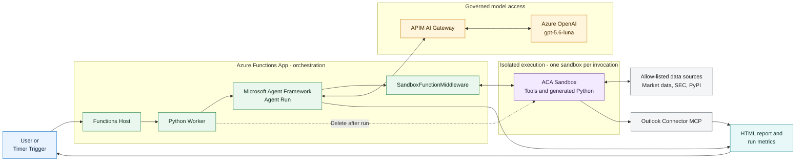
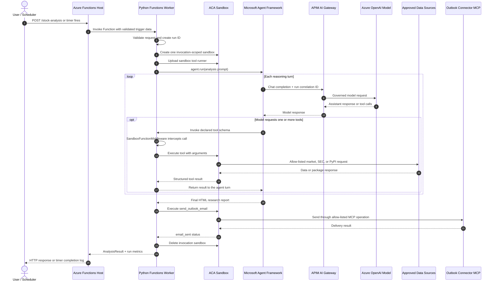

# Sandboxed stock-analysis Function App

This spike runs a Microsoft Agent Framework (MAF) equity-research agent in a Python Azure
Functions worker while forcing every model-requested tool call into Azure Container Apps Sandbox.
The worker contains tool schemas only. Each HTTP or timer invocation creates one isolated sandbox
in the sanctioned Sandbox Group. `SandboxFunctionMiddleware` routes every tool call to that same
sandbox and persistent filesystem. The sandbox is deleted when the Function invocation completes.

The app exposes:

- `POST /stock-analysis` for synchronous HTTP analysis.
- A weekday timer trigger, configurable with `STOCK_ANALYSIS_SCHEDULE`.
- Automatic Outlook email delivery through a Connector Namespace MCP server. Email execution
  occurs in the same invocation-scoped sandbox.

> The synchronous HTTP path can exceed Azure's front-end response limit for long analyses. The
> timer path is the reliable option for heavy runs; production HTTP workloads should normally use
> a queue/deferred response pattern.

## Architecture

### At-a-glance block diagram



The green Functions area owns orchestration and the agent loop. The purple sandbox owns all tool
and generated-code execution. A single sandbox is reused for the invocation and deleted after the
report and email result are produced.

### Detailed request sequence



**Execution boundary:** MAF and the LLM orchestration run in the Python worker, but declared tool
bodies never execute there. `SandboxFunctionMiddleware` intercepts each tool request and sends it
to the single ACA Sandbox owned by that Function invocation. The sandbox is reused for the full
agent run and deleted during cleanup.

1. The Function App calls `gpt-5.6-luna` through the configured APIM AI Gateway.
2. MAF exposes market-history, SEC-facts, portfolio-metrics, and generated-Python schemas.
3. `SandboxFunctionMiddleware` never calls the Python tool body.
4. Each Function invocation boots one sandbox from the `stock-analysis-python` disk and reuses it
   for all tool calls and generated code in that run.
5. The sandbox applies deny-by-default egress and allows only PyPI, selected market-data hosts,
   SEC hosts, Entra login, and the deployed Outlook MCP endpoint.
6. The completed HTML report is sent from the same invocation-scoped sandbox and then returned to
   the HTTP caller or logged by the timer invocation.

## Request

```json
{
  "symbols": ["MSFT", "NVDA", "AAPL"],
  "objective": "Compare quality, growth, valuation, momentum, and downside risk.",
  "period": "1y",
  "interval": "1d",
  "additional_context": "Focus on a 12-24 month research horizon."
}
```

## Configure and deploy

Install Azure Developer CLI before deployment. Replace each placeholder below with values from
your Azure environment. Do not commit subscription keys, connector credentials, recipient
addresses, or generated `azd` environment files.

```powershell
azd auth login
azd init
azd env set AZURE_LOCATION westus2
azd env set ACA_SANDBOX_SUBSCRIPTION_ID <subscription-id>
azd env set ACA_SANDBOX_RESOURCE_GROUP <sandbox-resource-group>
azd env set ACA_SANDBOX_GROUP <sanctioned-sandbox-group>
azd env set ACA_SANDBOX_REGION westus2
azd env set ACA_SANDBOX_DISK stock-analysis-python
azd env set ACA_SANDBOX_BASE_IMAGE mcr.microsoft.com/devcontainers/python:1-3.13-bookworm
azd env set APIM_AI_GATEWAY_ENDPOINT https://<apim-name>.azure-api.net/<model-api-path>
azd env set APIM_AI_MODEL gpt-5.6-luna
azd env set TO_EMAIL <recipient@example.com>
azd up
```

Create the custom group disk after provisioning. Export the `azd` values into the current shell,
then run:

```powershell
$values = azd env get-values
$values | ForEach-Object {
  if ($_ -match '^([^=]+)="(.*)"$') {
    [Environment]::SetEnvironmentVariable($Matches[1], $Matches[2], 'Process')
  }
}
.venv\Scripts\python.exe scripts\prepare_sandbox_disk.py
```

Authorize the Office 365 connection at:

```text
https://connectors.azure.com/<subscription-id>/rg-<azd-environment>/<connector-gateway-name>/overview
```

The connector must show `Connected` before the first email smoke test.

## Local validation

```powershell
.venv\Scripts\python.exe -m pip install -r src\requirements.txt pytest pytest-asyncio
.venv\Scripts\python.exe -m pytest -q
```

For local Functions execution, copy deployed `O365_MCP_SERVER_URL` into
`src\local.settings.json`, start Azurite, and run `func start` from `src`.

## Security boundaries

- Tool bodies fail if middleware is missing, preventing accidental worker execution.
- Sandboxes use deny-by-default egress with full inspection.
- Generated code and PyPI packages execute only in the sandbox.
- The Function identity receives Sandbox Group data-plane and connector access. Connector tokens
  are injected by the sandbox egress proxy and never staged inside the sandbox filesystem.
- No model, APIM, or connector credentials are committed. `APIM_SUBSCRIPTION_KEY` is optional and
  should be stored only in `azd`/Function App settings if APIM requires it.
- The app deletes each sandbox after success, failure, invalid output, or timeout and surfaces
  cleanup failures.
